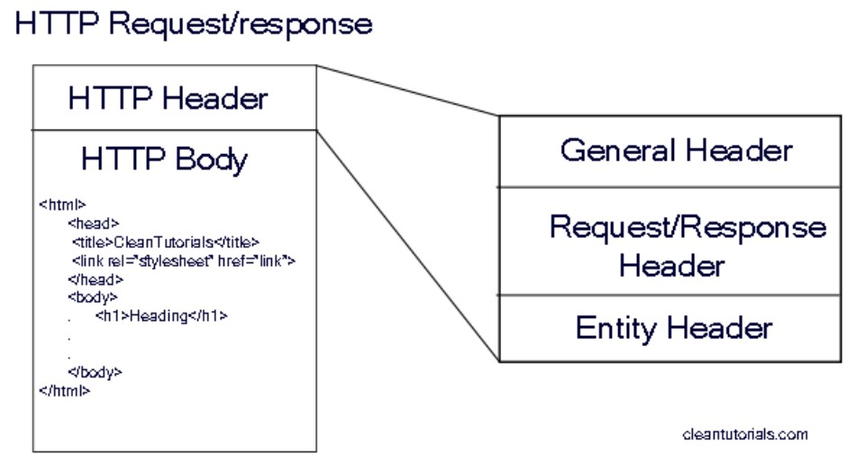
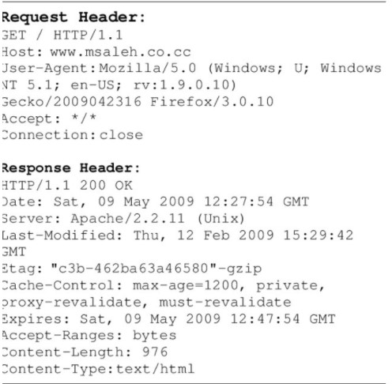

# Práctica 7: Servidor HTTP basico

> Primera Parcial

- FACULTAD DE TELEMATICA
- INGENIERÍA EN SOFTWARE
- “4ºG”
- ESTRUCTURA DE DATOS
- CATEDRATICO: ULIBARRI IRETA CARLOS
- AGUIRRE ROMERO RAMÓN ALEJANDRO

## OBJETIVO

- NPM
- Node Servers

> ENTREGA: DOMINGO 13 DE MARZO DEL 2022

## INFORMACIÓN ADICIONAL

- HTTP
  text ................

- Servidor HTTP
  text...

- Formato del paquete HTTP (esquema)
  text

- 
  text

- HTTP Request
  text

- HTTP Response
  text

- Puerto TCP
  text

- Métodos HTTP
  text

- 
  text

## EXPLICACIÓN DEL PROCESO

1. Esta es la continuacion de la practica 5 por lo que tamaremos todo el codigo que se encuentra en el directorio "emisor"

2. Ahora en lugar de utilizar el require('./emitter') utilizaremos require('events') que es el "Event emitter" de NODE JS de esa manera podremos utilizarlo

3. Pruebalo con Node app y comenta el resultado

4. Para continuar se crea un archivo config.js ingresando un module.exports el cual contendra un objeto llamado events y dentro de este se colocaran los elementos GREET y JUMP, en su contenido tendrean el string nesesario para invocar ese elemento en el otro objeto.

5. Inyectar la dependencia de config.js en app.js

6. Ahora todas las llamadas a metodos dentro de app.js deberan ser cambiadas de tener el string ('greet') a tener el metodo para obtener el string (config.events.GREET), Esto debera ser realizado con GREET y JUMP

7. Para funalizar ejecuta node app y explica el resultado
